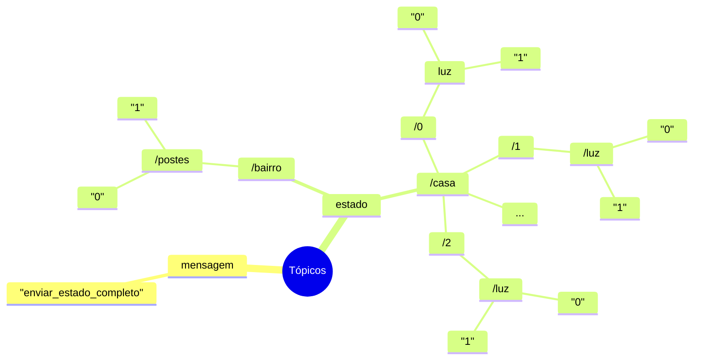
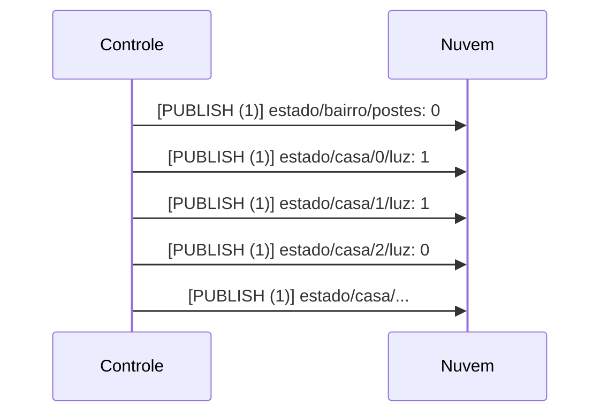
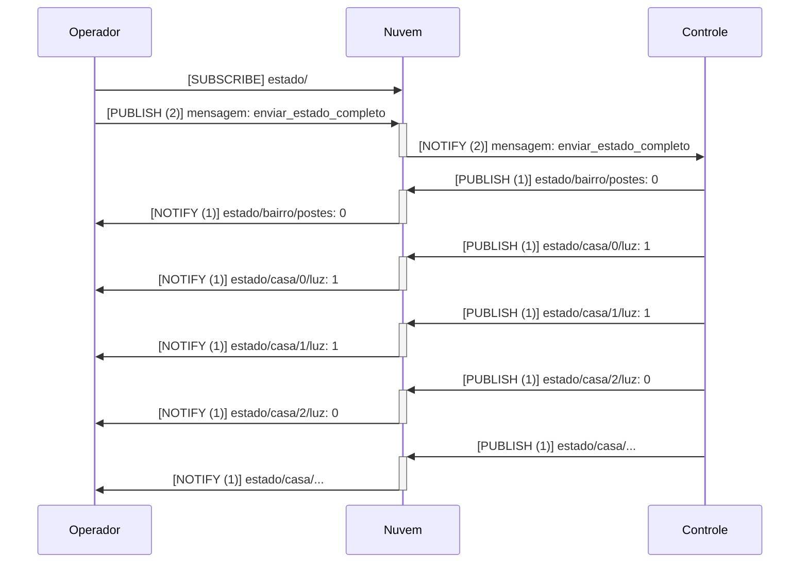
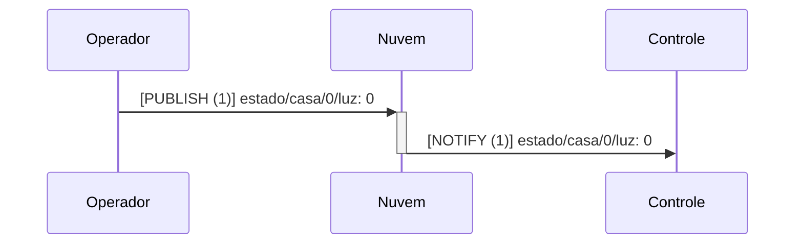
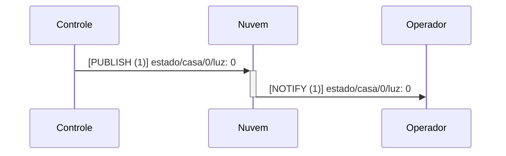

# ITL 2023.1

Projeto de condomínio de casas inteligentes.

## Níveis de controle

- Bairro:
  - Iluminação pública (`postes`): valor `0` para desligado e `1` para ligado.
- Casas:
  - Iluminação (`luz`): valor `0` para desligado e `1` para ligado.

O protocolo MQTT será usado neste projeto, pois:

- Possui sistema de mensagens PubSub para assinaturas e notificações.
- Cada sensor ou atuador pode ter tópico específico, hierarquizado, para permitir diversos formatos de assinatura: `estado/#`, `estado/casa/0/luz` etc.
- Permite um sistema interno de mensagens para solicitar, entre outros, o estado completo do bairro.

Exemplo: o operador do sistema poderá solicitar uma sincronização do seu aplicativo cliente (celular) com o estado atual do bairro. Ele envia uma mensagem:

```
mensagem: enviar_estado_completo
```

E receberá, em cada assinatura, a atualização específica:

```
estado/bairro/postes: 0
estado/casa/0/luz: 1
estado/casa/1/luz: 1
estado/casa/2/luz: 0
estado/casa/...
```

Logo, poderá haverá várias interfaces de operador, com mais ou menos informação em relação as casas. Nota: ao todo são 12 casas, mas para facilitar a leitura serão apresentadas até o `2` seguido de `...`.



## Trocas de mensagens

A seguir, os cenários possíveis de troca de mensagens entre controle e operador(es).

### Início do sistema de controle do bairro

Ao iniciar o sistema de controle, é preciso atualizar os assinantes, de forma a sincronizar todos os estados. Nesse caso, o QoS 1 para a mensagem é suficiente: a informação precisa ser entregue, porém pela sua idempotência, pode haver duplicação de entrega.



### Entrada do operador (usuário) no sistema

Assim que o operador inicia o aplicativo, é preciso receber todos os estados para apresentar a tela de controle do cenário. Logo, o primeiro passo é assinar (`MQTT Subscribe`) todos os estados (árvore de tópicos `estado/#`) para recebê-los na sequência. Assim como o caso anterior, o QoS 1 é suficiente para o envio dos estados. Porém, para evitar o envio desnecessário do estado completo múltiplas vezes, a solicitação deve ter QoS 2.



### Atualização de estado por ação de operador

Assim como no primeiro caso, mensagens idempotentes têm QoS 1:



O controle enviará, na sequência, o comando de desligar a luz para o atuador da casa `0`.

### Atualização de estado por ação de controle (sensor ou atuador)

Primeiro, ou:

- O sensor detecta a alteração de estado;
- O atuador foi acionado por comando externo a este sistema.

Na sequência, o controle é notificado e envia a atualização para os assinantes com QoS 1 (idem ao caso anterior):


